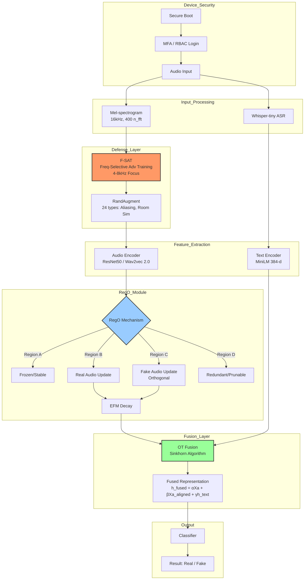

# System Architecture: Socio-Acoustic Edge Guardian

## Overview
The **Socio-Acoustic Edge Guardian** is a lightweight, field-operative edge agent designed for deepfake detection and authenticity verification. It operates offline on smartphones and body-cams, utilizing a multimodal approach that fuses audio features with linguistic analysis.

## Core Components

1.  **Audio Preprocessing**:
    *   Input: Raw Audio
    *   Conversion: Mel-spectrogram (16 kHz, 400 n_fft)
    *   Augmentation: F-SAT (Frequency-Selective Adversarial Training) targeting 4-8k Hz.

2.  **Feature Extraction**:
    *   **Audio Branch**: ResNet50 or Wav2vec 2.0 backbone.
    *   **Text Branch**: Whisper-tiny ASR for local transcription -> MiniLM for 384-d semantic embeddings.

3.  **Region-Based Optimization (RegO)**:
    *   **Importance Region Localization (IRL)**: Partitions neurons into regions A, B, C, D using Fisher Information Matrix.
    *   **Continual Learning**: Updates Region B (real) and Region C (fake) orthogonally.
    *   **Ebbinghaus Forgetting Mechanism (EFM)**: Decays redundant neurons.

4.  **Multimodal Fusion (OT Fusion)**:
    *   **Alignment**: Sinkhorn-based Optimal Transport with entropic regularization ($\epsilon = 0.05$).
    *   **Fusion**: Weighted sum of audio, aligned audio, and text features.

5.  **Classification**:
    *   Output: Real vs. Fake probability.

6.  **Device Security & Integrity (eRaksha Requirement)**:
    *   **RBAC**: Role-Based Access Control for device operators vs. commanders.
    *   **MFA**: Multi-Factor Authentication for device unlock/config.
    *   **Secure Firmware**: Signed bootloaders to prevent tampering.

## System Flowchart

